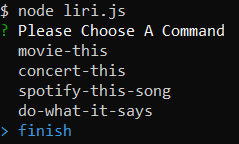

#LIRI (Language Interpretation Recognition Interface)
A Node.JS command line application ,it takes one of this commands and performs an action.
   movie-this
   concert-this
   spotify-this-song
   do-what-it-says

You can both type the commands or wait to be asked to choose one of then.
  
  